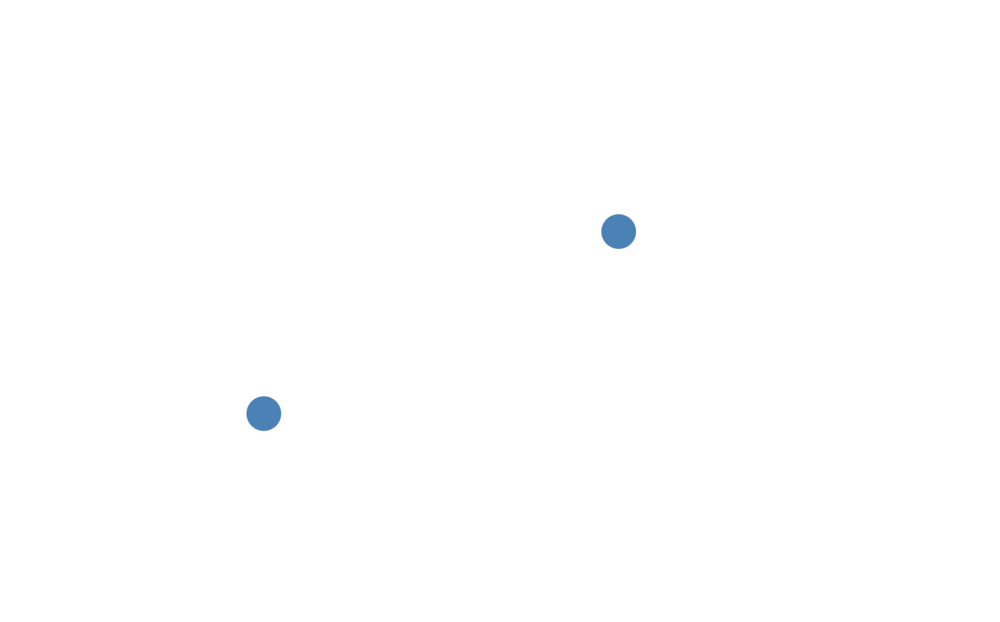
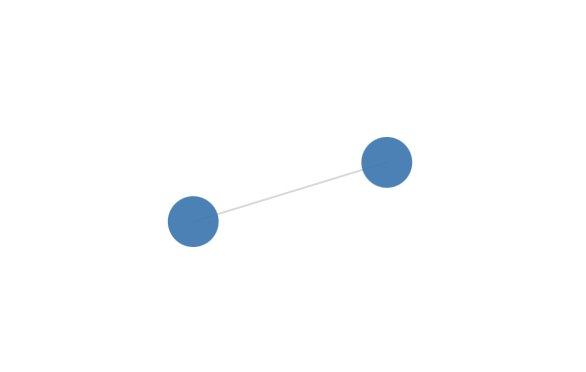

Recently I have worked on a Graph View feature in our app, which consisted of visualizing links and hierarchies of user Pages. I have used the [Force Graph](https://github.com/vasturiano/force-graph) library which appealed to me by its simplicity and great capabilities.

This tutorial covers the integration of the Force Graph library with the Nuxt framework for data visualization. You will learn how to create an interactive graph visualization, fitting for many use cases ([1](https://help.obsidian.md/Plugins/Graph+view),[2](https://cytoscape.org/what_is_cytoscape.html),[3](https://arxiv.org/pdf/2106.12839.pdf)).

# Installing Nuxt and setting up the project

First of all, we have to set up our project. We will be using [Nuxt](https://nuxtjs.org/docs/get-started/installation) framework for its simplicity - we can get it up and running in about 2 minutes.

## Prerequisites

- [Node](https://nodejs.org/en/download/) - I have used Node 16
- IDE - [vscode](https://code.visualstudio.com) / [WebStorm](https://www.jetbrains.com/webstorm/) / [Vim (hardcore coders only)](https://www.vim.org)
- terminal (optional, though highly recommended) - I will not cover the steps needed to set up Nuxt project without a terminal

Let's dive right in. Open up your terminal, navigate to a folder you will be working in and execute the following command to create a nuxt project.

```bash
npm init nuxt-app graph-demo
```

If this is your first nuxt app, you may be prompted to install `create-nuxt-app` package. Just input `y` and press enter.

```plaintext
Need to install the following packages:
  create-nuxt-app@5.0.0
Ok to proceed? (y) 
```

The setup will start automatically, and you will be prompted to select some options for your project. To read more about the options, you can see the [create-nuxt-app documentation](https://github.com/nuxt/create-nuxt-app/blob/master/README.md). I chose the following settings:

```
create-nuxt-app v5.0.0
✨  Generating Nuxt.js project in graph-demo
? Project name: graph-demo
? Programming language: TypeScript
? Package manager: Npm
? UI framework: None
? Template engine: HTML
? Nuxt.js modules: (Press <space> to select, <a> to toggle all, <i> to invert 
selection)
? Linting tools: ESLint, Prettier
? Testing framework: None
? Rendering mode: Single Page App
? Deployment target: Static (Static/Jamstack hosting)
? Development tools: (Press <space> to select, <a> to toggle all, <i> to inver
t selection)
? Continuous integration: None
? Version control system: Git
```

Your project will set up and install all the initial dependencies. We need to install the [Force Graph](https://www.npmjs.com/package/force-graph) package to use it later, so while you are inside a terminal, run the following commands to navigate to the folder your app lives in and install the package:

```bash
cd graph-demo
npm i force-graph
```

We are almost set to leave the terminal for now, just run one last command to start the project up.

```bash
npm run dev
```

You have just started a local development server, which serves your app on the [localhost:3000](http://localhost:3000). If you open the site in your browser you will see the default Vue project. We are now ready to make changes to the app so open your project in an IDE.

Navigate to the `components` folder and create a file called `Graph.vue` inside the folder. The structure should look like this:

```
graph-demo
| components
    | Graph.vue
| pages
    | index.vue
```

With the `Graph.vue` file open, type or paste in the following piece of code:

```vue
<template><div ref="graph"></div></template>
<script>
import ForceGraph from 'force-graph';
import Vue from "vue";

export default Vue.extend({
  name: 'Graph',
  data() {
    return {
      data: {nodes: [], links: []},
      graph: ForceGraph(),
    }
  },
  methods: {
    drawGraph() {
      this.graph(this.$refs.graph).graphData(this.data);
    }
  },
  mounted() {
    this.drawGraph();
  }
})
</script>
```

We have just created a `Graph` component that uses the ForceGraph library to render a graph representation of some data we provide. In this example we provide no nodes and no links so we render an empty graph.

Finally, you can then open the `pages/index.vue` file and replace the `Tutorial` component with your newly created `Graph` component. The file should look like this:
```vue
<template>
  <div>
    <Graph />
  </div>
</template>

<script lang="ts">
import Vue from 'vue'
import Graph from "~/components/Graph.vue";

export default Vue.extend({
  name: 'IndexPage',
  components: {Graph},
})
</script>
```

Now if you navigate to the index page ([localhost:3000/](http://localhost:3000/)), you should see an empty screen. This is your graph, but because we did not provide any nodes, the graph is empty. Let's fix that.

# Adding data

Adding nodes to the graph is simple - all a node needs is a unique id. You can add the nodes to the `data` variable of our `Graph` component.

```
data: {nodes: [{id: 0}, {id: 1}], links: []}
```

2 nodes just landed in your graph. Nice.



Now let's connect them using a link. To create a link, we need to specify the `source` node and the `target` node.
```
data: {nodes: [{id: 0}, {id: 1}], links: [{source: 0, target: 1}]},
```

Your nodes are now linked.



Since everybody needs a friend (or two), lets add 100 more nodes:
```javascript
<template><div ref="graph"></div></template>
<script>
import ForceGraph from 'force-graph';
import Vue from "vue";

export default Vue.extend({
  name: 'Graph',
  data() {
    return {
      graph: ForceGraph(),
    }
  },
  methods: {
    drawGraph() {
      this.graph(this.$refs.graph).graphData({nodes: this.getNodes, links: this.getLinks});
    }
  },
  computed: {
    getNodes() {
      const nodes = [];
      for (let i = 0; i < 100; i++) {
        nodes.push({id: i});
      }
      return nodes;
    },
    getLinks() {
      return [];
    }
  },
  mounted() {
    this.drawGraph();
  }
})
</script>
```

We added computed properties `getNodes` and `getLinks`. Computed property is a function that is used to calculate a value we can use - sort of like a getter. It is useful when reusing the same calculation or filtering the results as it uses caching and only recomputes when the data changes.

We have used it to produce 100 nodes. I have left the `getLinks` function empty, so you can try to implement your own (random) links getter.

*Hint: to generate a random number from 0 to 100 in js, you can use `Math.floor(Math.random()*100)`*

Now that we have the basics down, lets advance to a real use case.

# Making a more complex graph
I have prepared some data ready for you to use. You can find the file here: {{github link}} and copy and paste the contents to `constants/index.ts` file (which you will need to create). The data is a collection of documents scraped ("borrowed") from a public obsidian vault with document links and tags extracted.

You can import the file adding the following line
```
import { DATA } from "~/constants";
```

to the imports. We then alter the `getNodes` and `getLinks` methods in the following way:

```typescript
getNodes() {
    return DATA.map(d => ({
        id: d.title,
        name: d.title,
        val: Math.sqrt(d.text.length),
      }))
    },
getLinks() {
  const links = [];
  const titles = DATA.map(d => (d.title));
  DATA.forEach(d => {
    if (d.links.length) {
      d.links.forEach(link => {
        links.push({
            source: d.title,
            target: link,
          })
        })
    }
  })
  return links;
}
```

If you have a look at your graph, you can see there are now more nodes and the nodes are connected by links.

In the `getNodes` method we create nodes from information about our documents - we use `title` as the node `id`, and use the length of the document as the node size by setting the `val` parameter of the node.

In the `getLinks` method we iterate over the documents and if a document references other document, we create node links for every reference.

# Making the graph interactive

Let's say the linked structure is not clear enough for you. We can fix that by adding some logic to highlight the node you click on and the connected nodes, so you can follow the thought path.

First, lets change the getNodes and getLinks methods for an easier access to our data and introduce some variables to our `data` function. The data function will look like this:

```typescript
data() {
    return {
      graph: ForceGraph(),
      defaultNodeColor: '#444444fa',
      highlightColor: '#999999fa',
	  isLinked: (node1, node2) => {
		// checks for a link between 2 nodes
        return node1.links.map(l => (l.source)).includes(node2) ||
          node1.links.map(l => (l.target)).includes(node2) ||
          node2.links.map(l => (l.source)).includes(node1) ||
          node2.links.map(l => (l.target)).includes(node1);
      }
    }
  },
```

We alter the getNodes and getLinks methods in the following way:

```typescript
getNodes() {
      return DATA.map(d => ({
        id: d.title,
        name: d.title,
        val: Math.cbrt(d.text.length),
        links: this.getLinksForNode(d),
        color: this.defaultNodeColor
      }))
    },
    getLinks() {
      const links = [];
      this.getNodes.forEach(node => {
          links.push(...node.links);
      })
      return links;
    }
```

So we now assign a color to each node as it is created and each node holds references to all its linked nodes.

We now can add a `onNodeClick` handler to our `drawGraph` method which will highlight the clicked node and all its connected nodes.

```typescript
drawGraph() {
  this.graph(this.$refs.graph)
    .graphData({nodes: this.getNodes, links: this.getLinks})
    .onNodeClick((node) => {
      this.graph
        .graphData()
        .nodes
        .forEach(n => {
          // clear previous highlights
          n.color = this.defaultNodeColor;
          // if node is linked to clicked node, highlight
          if (this.isLinked(n, node)) {
            n.color = this.highlightColor;
          }
        });
     //  highlight the clicked node
     node.color = this.highlightColor;
  })
}
```

Now each time a node is clicked, the graph goes over all the nodes, clears all previous highlights and if a node is connected to the clicked node, it is highlighted.

One problem we now have is that we can not fully cancel the highlight. I will leave the solution for this problem to you.
Hint: you can use `onBackgroundClick` method as described [here](https://github.com/vasturiano/force-graph).

# Displaying the titles

The last thing we can try is displaying node name the whole time instead of only on node hover. To do this, we will have to override the default node rendering function with our own.

```typescript
drawGraph() {
    this.graph(this.$refs.graph)
        .graphData({nodes: this.getNodes, links: this.getLinks})
        .nodeCanvasObject((node, ctx, globalScale) => {
            ctx.font = `12px Sans-Serif`;
            ctx.textAlign = 'center';
            ctx.textBaseline = 'middle';
            ctx.fillStyle = node.color;
            ctx.beginPath();
            ctx.arc(node.x, node.y, node.val, 0, 2 * Math.PI, false);
            ctx.fill();
            ctx.fillText(
                node.name,
                node.x,
                node.y + node.val + 3,
            );
        })
}
```

What this does, is in every render step, it iterates over all the nodes, draws them as an `arc` with a diameter of `node.val`, and coordinates of `node.x, node.y`. After the node is drawn, the text is also drawn using the `fillText` method.

# Closing Thoughts
That is all from me for today. Thank you for reading. I plan on publishing a follow-up blog about some challenges we had to deal with when using a similar solution in a production app. I will link the blog here, so be sure to check back soon.
