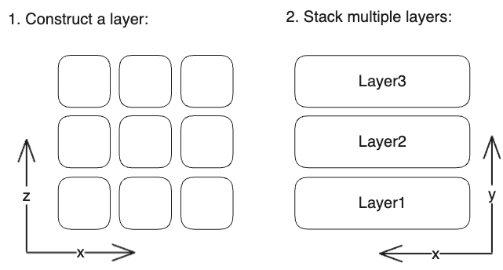
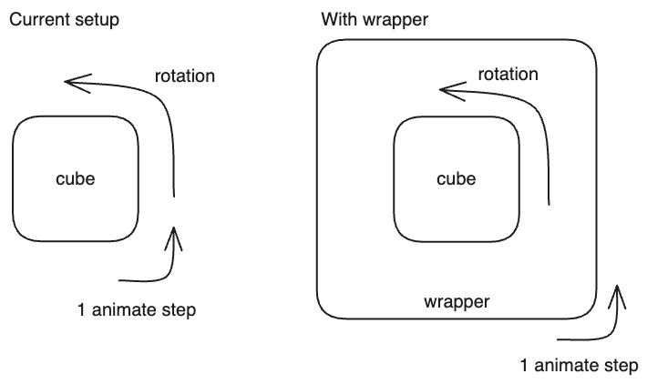

<iframe src="../public/resend_cube_2.html" height="400px" width="100%" style="border:none;"></iframe>
<figcaption align = "center">The final result. Interactive. (code at the end of the post)</figcaption>

The unfinished stuff from [Making the Resend cube from scratch using Three.js](https://devslovecoffee.com/making-the-resend-cube-from-scratch-using-three-js/) bothered me, So part 2 with bloom and animation is here. This is a continuation of my previous post and builds on the code we have produced, so be sure to check it out and catch up.

# First things first

In order to do the fun stuff, we need to rework the imports. It works in the current, very simple, setup, but adding more imports - like bloom, or render pass, just won't work, as they are not in the main three.js lib.

What we will use is called an *importmap* - basically a JSON object, that is used by js to map your imports within a module to their corresponding value, represented as an URL. Using importmap allows us to import and specific packages from the three.js examples.

We will just add this piece of code to the `<head>` part of our code.

```html
<script type="importmap">
  {
    "imports": {
      "three": "https://cdn.jsdelivr.net/npm/three@0.142.0/build/three.module.js",
      "OrbitControls":"https://cdn.jsdelivr.net/npm/three@0.142.0/examples/jsm/controls/OrbitControls.js",
    }
  }
</script>
```

Then add the following to our `<script>`:

```javascript
import * as THREE from 'three';
import { OrbitControls } from 'OrbitControls';
```

We are now using a different version of `OrbitControls`, so we need a different setup:

```javascript
const controls = new OrbitControls(camera,renderer.domElement);
// disable zoom
controls.enableZoom = false;
// disable pan
controls.enablePan = false;
```

We have removed the `THREE_ADDONS` from before using `OrbitControls` (since we import it in a different way), and added the lines to disable zoom and pan as those are implemented in this version. The cube should look exactly the same, but now we can build further.

We now have an extensible imports solution, allowing us to use all the goodness that three.js provides.

# Bloom

With the imports out of the way, we can start with the relatively straightforward thing to implement - Bloom. To add the bloom effect, we need to add some things:
- the first one is `EffectComposer`, which lets you add different post-processing effects
- the second thing we add is a `RenderPass`, which allows you to chain the actual events
- the last thing we add is the `UnrealBloomPass` - the actual filter responsible for the bloom

To do all this, we start with editing the `importmap` to add the imports:

```html
<script type="importmap">
  {
    "imports": {
      "three": "https://cdn.jsdelivr.net/npm/three@0.142.0/build/three.module.js",
      "OrbitControls":"https://cdn.jsdelivr.net/npm/three@0.142.0/examples/jsm/controls/OrbitControls.js",
      "UnrealBloomPass":"https://cdn.jsdelivr.net/npm/three@0.142.0/examples/jsm/postprocessing/UnrealBloomPass.js",
      "EffectComposer":"https://cdn.jsdelivr.net/npm/three@0.142.0/examples/jsm/postprocessing/EffectComposer.js",
      "RenderPass":"https://cdn.jsdelivr.net/npm/three@0.142.0/examples/jsm/postprocessing/RenderPass.js"
    }
  }
</script>
```

then we import them in our module like so:

```javascript
import * as THREE from 'three';
import { UnrealBloomPass } from 'UnrealBloomPass';
import { EffectComposer } from 'EffectComposer';
import { RenderPass } from 'RenderPass';
import { OrbitControls } from 'OrbitControls';
```

Now we can replace the old code creating the renderer:

```javascript
// Create the renderer
const renderer = new THREE.WebGLRenderer();
renderer.setSize(window.innerWidth, window.innerHeight);
document.body.appendChild(renderer.domElement);
```

with the *new* code creating the renderer, the effects composer and adding the bloom effect:

```javascript
// Create the renderer
const renderer = new THREE.WebGLRenderer();
renderer.setSize(window.innerWidth, window.innerHeight);
// make it sharper
renderer.setPixelRatio(window.devicePixelRatio * 1.5);
document.body.appendChild(renderer.domElement);

// Create effects
const bloomPass = new UnrealBloomPass(new THREE.Vector2(1000, 1000), 1.5, 0.4, 0.85)
bloomPass.threshold = 0.3
bloomPass.strength = 0.7
bloomPass.radius = 0.2
bloomPass.renderToScreen = true

var composer = new EffectComposer(renderer);
composer.setSize(window.innerWidth, window.innerHeight);
var renderPass = new RenderPass(scene, camera);

composer.addPass(renderPass);
composer.addPass(bloomPass);
```

As the final step, we replace the `renderer.render(scene, camera);` call in the animate function with `composer.render();` and we are done. Now our cube looks a bit more sexy thanks to the bloom effect.

The parameters for the bloom effect are adjustable and I have not explored too many options - I've just used whatever looked ok. Feel free to experiment with them and search for a better look.

# Animation

Now we want to add the animation - rotating the sides of the cube. The Resend cube, our inspiration, always rotates 2 opposite sides in random intervals - leading me to believe that the construction of the cube is the following:


 
Rotating then is a simple act of rotating layers 1 and 3, 180 degrees (or PI). Sounds easy enough. 

Firstly, we need to augment the function used to create the cube.

```javascript
function makeCubes() {
    const material = new THREE.MeshStandardMaterial({ color: 0x2a2a2a, metalness: 1, roughness: 0.11 });
    const numCubes = 3;
    // Create the group, we will add layers to the group
    const cubes = new THREE.Object3D();
    const offset = (numCubes - 1) / 2;
    // iterate over all dimensions
    for(let i = 0; i < numCubes; i ++) {
        // create the layer
        const layer = new THREE.Object3D();
        for(let j = 0; j < numCubes; j ++) {
            for(let k = 0; k < numCubes; k ++) {
                const geom = createBoxWithRoundedEdges(1, 1, 1, .17, 20);
                const x = (i - offset) * 1.03;
                const y = (j - offset) * 1.03;
                const z = (k - offset) * 1.03;
                geom.translate(x, y, z);
                const cube = new THREE.Mesh(geom, material);
                layer.add(cube);
            }
        }
        cubes.add(layer);
    }
return cubes;
}
```

We now create the cube as an object which holds the layers, that hold the actual cubes - exactly as is shown in the picture above. We have also enhanced the cube creation a little bit - the numCubes now works properly and spawns the correct amount of cubes per side, we always center the cube using the offset, and we have added a little bit of spacing between the cubes.

That's all for the structure side of the animation. To rotate the layers, I have found a neat little [function](https://stackoverflow.com/questions/31753860/using-three-js-and-tween-js-to-rotate-object-in-90-degree-increments-to-create-a). It uses the TWEEN library to interpolate between 2 states over some time. It is set up to endlessly repeat itself rotating the layers.

The setup process for tween is similar to the others:

1. add to `importmap`: `"tween": "https://cdn.jsdelivr.net/npm/@tweenjs/tween.js@18.5.0/dist/tween.esm.js"`
2. add to the start of you module: `import TWEEN from 'tween';`
3. add to your `animate` function: `TWEEN.update();` so TWEEN knows when to update the interpolated states

You are now ready to use TWEEN. The rotate function itself is pretty straightforward: it takes the `object` it should rotate, the `angle` to rotate the object, `time` over which to rotate, and the `pause` between 2 rotations, and endlessly calls itself rotating the object and waiting for the set time.

```javascript
function tRotate( obj, angles, delay, pause ) {
    new TWEEN.Tween(obj.rotation)
    .delay(pause)
    .to( {
        x: obj.rotation._x + angles.x,
        y: obj.rotation._y + angles.y,
        z: obj.rotation._z + angles.z
    }, delay )
    .onComplete(function() {
        setTimeout( tRotate, pause, obj, angles, delay, pause );
    })
    .start();
}
```

We can call the function right after adding the cube to the scene, with the object we rotate being the first of the layers - `object.chilren[0]`:

```javascript
// Create a cube
const cube = makeCubes();
scene.add(cube);

tRotate(cube.children[0], {x:-Math.PI,y:0,z:0}, 2000, 1000 );
```

You should notice one side of your cube rotating. It is always the same side though, which doesn't look that good.

## Fancier animation

To make the feeling better we can do a little trick - rotate the whole cube 90 degrees along one of the axes right before the side rotates, which will produce the effect of rotating a different side every time.

The current setup of the cube would not allow for this because of a simple reason - we already rotate the cube in our animate function. Were we to rotate the whole cube before rotating one of its sides, it would change direction completely, messing up the whole feeling. 

What we need to do is add a wrapper to the cube, rotate the wrapper continuously, and, when the time comes, rotate the wrapped element.



Adding the wrapper is easy - we just add this at the end of our `makeCubes` function:

```javascript
const wrapper = new THREE.Object3D();
wrapper.add(cubes);
return wrapper;
```

We basically take the cubes object and just wrap it in another object. What is does is allow us to transform (including rotate) each object separately.

The only thing left is to augment the `tRotate` function to rotate the inner cube before rotating the side, and the call of the function, to pass the correct elements needed to rotate:

```javascript
function tRotate( parent, children, angles, delay, pause ) {
    parent.rotateY(Math.PI / 2);
    parent.rotateZ(Math.PI / 2)
    new TWEEN.Tween(children.rotation)
    .delay(pause)
    .to( {
        x: children.rotation._x + angles.x,
        y: children.rotation._y + angles.y,
        z: children.rotation._z + angles.z
    }, delay )
    .onComplete(function() {
        setTimeout( tRotate, pause, parent, children, angles, delay, pause );
    })
    .start();
}
...
// cube.children[0] = the wrapped cube; cube.children[0].children[0] = one side of the wrapped cube
tRotate(cube.children[0], cube.children[0].children[0], {x:-Math.PI,y:0,z:0}, 2000, 1000 );
```

## Adding Randomness

Some other enhancements we could do to make the feel more refined are:
- rotate a random layer of the cube
- use a random direction of the rotation.
- rotate the whole cube along a random axis
- randomize the pause between rotations

```javascript
function tRotate( cube, delay ) {
    // rotate the wrapped cube 90 deg along y/z axis
    if (Math.random() > 0.5) {
    cube.rotateY(Math.PI / 2);
    }
    else {
    cube.rotateZ(Math.PI / 2);
    }
    // pick a random layer to rotate
    const sideIndex = Math.floor(Math.random() * 3);
    const side = cube.children[sideIndex];

    // pick a random direction to rotate
    const angles = {
        x: Math.random() > 0.5 ? -Math.PI : Math.PI,
        y:0,
        z:0
    }

    // pick a random time to wait between rotations
    const pause = Math.random() * 1000;

    new TWEEN.Tween(side.rotation)
        .delay(pause)
        .to( {
            x: side.rotation._x + angles.x,
            y: side.rotation._y + angles.y,
            z: side.rotation._z + angles.z
        }, delay )
        .onComplete(function() {
            setTimeout( tRotate, pause, cube, delay );
        })
        .start();
}
...
// cube.children[0] = the wrapped cube; cube.children[0].children[0] = one side of the wrapped cube
tRotate(cube.children[0], 2000);
```

# Final remarks

We now have a pretty solid Resend cube lookalike (with our own animation enhancement as well :) ). There are some parts of the Resend cube which we don't have yet, that make id run and looks better. I suspect it is partly due to the lights, but I already have a solution in mind, and the running better part should be fixable with some optimizations.

I have originally wanted to do bloom, animation, better lightning and the god rays in this post, but it got too long right around the animation part. Sorry for that. I want to do these things however, so expect a part 3 with the lightning, god rays, and optimizations.

Once again, the complete code can be found below:

```html
<!DOCTYPE html>
<html lang="en">
<head>
    <meta charset="UTF-8">
    <title>Resend Cube Lookalike</title>
    <style>
        body { margin: 0; }
        canvas { display: block; }
    </style>
    <script type="importmap">
        {
            "imports": {
                "three": "https://cdn.jsdelivr.net/npm/three@0.142.0/build/three.module.js",
                "OrbitControls":"https://cdn.jsdelivr.net/npm/three@0.142.0/examples/jsm/controls/OrbitControls.js",
                "UnrealBloomPass":"https://cdn.jsdelivr.net/npm/three@0.142.0/examples/jsm/postprocessing/UnrealBloomPass.js",
                "EffectComposer":"https://cdn.jsdelivr.net/npm/three@0.142.0/examples/jsm/postprocessing/EffectComposer.js",
                "RenderPass":"https://cdn.jsdelivr.net/npm/three@0.142.0/examples/jsm/postprocessing/RenderPass.js",
                "tween": "https://cdn.jsdelivr.net/npm/@tweenjs/tween.js@18.5.0/dist/tween.esm.js"
            }
        }
    </script>
</head>
<body>

<script type="module">
    import * as THREE from 'three';
    import TWEEN from 'tween';
    import { UnrealBloomPass } from 'UnrealBloomPass';
    import { EffectComposer } from 'EffectComposer';
    import { RenderPass } from 'RenderPass';
    import { OrbitControls } from 'OrbitControls';

    const CUBES_PER_SIDE = 3;

    function createBoxWithRoundedEdges( width, height, depth, radius0, smoothness ) {
        let shape = new THREE.Shape();
        let eps = 0.00001;
        let radius = radius0 - eps;
        shape.absarc( eps, eps, eps, -Math.PI / 2, -Math.PI, true );
        shape.absarc( eps, height -  radius * 2, eps, Math.PI, Math.PI / 2, true );
        shape.absarc( width - radius * 2, height -  radius * 2, eps, Math.PI / 2, 0, true );
        shape.absarc( width - radius * 2, eps, eps, 0, -Math.PI / 2, true );
        let geometry = new THREE.ExtrudeBufferGeometry( shape, {
            depth: depth - radius0 * 2,
            bevelEnabled: true,
            bevelSegments: smoothness * 2,
            steps: 1,
            bevelSize: radius,
            bevelThickness: radius0,
            curveSegments: smoothness
        });

        geometry.center();

        return geometry;
    }

    function makeCubes() {
        const material = new THREE.MeshStandardMaterial({ color: 0x2a2a2a, metalness: 1, roughness: 0.11 });
        const numCubes = CUBES_PER_SIDE;
        // Create the group, we will add layers to the group
        const cubes = new THREE.Object3D();
        // iterate over all dimensions
        const offset = (numCubes - 1) / 2;
        for(let i = 0; i < numCubes; i ++) {
            // create the layer
            const layer = new THREE.Object3D();
            for(let j = 0; j < numCubes; j ++) {
                for(let k = 0; k < numCubes; k ++) {
                    const geom = createBoxWithRoundedEdges(1, 1, 1, .17, 20);
                    const x = (i - offset) * 1.03;
                    const y = (j - offset) * 1.03;
                    const z = (k - offset) * 1.03;
                    geom.translate(x, y, z);
                    const cube = new THREE.Mesh(geom, material);
                    layer.add(cube);
                }
            }
            cubes.add(layer);
        }
        const wrapper = new THREE.Object3D();
        wrapper.add(cubes);
        return wrapper;
    }

    function tRotate( cube, delay ) {
        // rotate the wrapped cube 90 deg along y/z axis
        if (Math.random() > 0.5) {
            cube.rotateY(Math.PI / 2);
        }
        else {
            cube.rotateZ(Math.PI / 2);
        }
        // pick a random layer to rotate
        const sideIndex = Math.floor(Math.random() * CUBES_PER_SIDE);
        const side = cube.children[sideIndex];

        // pick a random direction to rotate
        const angles = {
            x: Math.random() > 0.5 ? -Math.PI : Math.PI,
            y:0,
            z:0
        }

        // pick a random time to wait between rotations
        const pause = Math.random() * 1000;

        new TWEEN.Tween(side.rotation)
                .delay(pause)
                .to( {
                    x: side.rotation._x + angles.x,
                    y: side.rotation._y + angles.y,
                    z: side.rotation._z + angles.z
                }, delay )
                .onComplete(function() {
                    setTimeout( tRotate, pause, cube, delay );
                })
                .start();
    }


    // Create the scene
    const scene = new THREE.Scene();
    scene.background = new THREE.Color( 0x000000 );

    // Create the light
    const light = new THREE.PointLight( 0xffffff, 100, 500 );
    light.position.set( 0, 5, 10 );
    scene.add( light );
    const light2 = new THREE.PointLight( 0xffffff, 10, 500 );
    light2.position.set( 0, -10, -5 );
    scene.add( light2 );

    // Create the camera
    const camera = new THREE.PerspectiveCamera(75, window.innerWidth / window.innerHeight, 0.1, 1000);

    // Create the renderer
    const renderer = new THREE.WebGLRenderer({antialias: true});
    renderer.setSize(window.innerWidth, window.innerHeight);
    // make it sharper
    renderer.setPixelRatio(window.devicePixelRatio * 1.5);
    document.body.appendChild(renderer.domElement);

    // Create effects
    const bloomPass = new UnrealBloomPass(new THREE.Vector2(1000, 1000), 1.5, 0.4, 0.85)
    bloomPass.threshold = 0.4
    bloomPass.strength = 0.7
    bloomPass.radius = 0.2
    bloomPass.renderToScreen = true

    var composer = new EffectComposer(renderer);
    composer.setSize(window.innerWidth, window.innerHeight);
    var renderPass = new RenderPass(scene, camera);

    composer.addPass(renderPass);
    composer.addPass(bloomPass);

    // Create a cube
    const cube = makeCubes();
    scene.add(cube);

    // cube.children[0] = the wrapped cube; cube.children[0].children[0] = one side of the wrapped cube
    tRotate(cube.children[0], 2000);

    // Position the camera
    camera.position.z = 10;

    const controls = new OrbitControls(camera,renderer.domElement);
    // disable zoom
    controls.enableZoom = false;
    // disable pan
    controls.enablePan = false;

    // Animate the cube
    function animate() {
        requestAnimationFrame(animate);
        cube.rotation.x += 0.005;
        cube.rotation.y += 0.005;
        cube.rotation.z += 0.005;
        controls.update();
        TWEEN.update();
        composer.render();
    }
    animate();
</script>
</body>
</html>
```

Part 1 - making the base cube here: [https://devslovecoffee.com/making-the-resend-cube-from-scratch-using-three-js/](https://devslovecoffee.com/making-the-resend-cube-from-scratch-using-three-js/).
Part 3 where tie it all up here: [https://devslovecoffee.com/resend-cube-lookalike-part-3/](https://devslovecoffee.com/resend-cube-lookalike-part-3/).