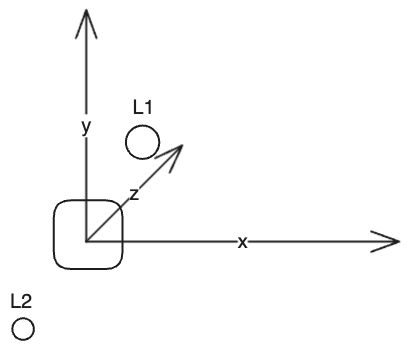
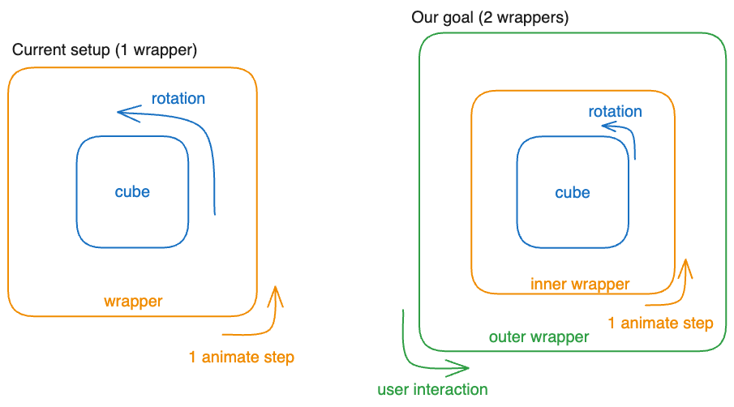
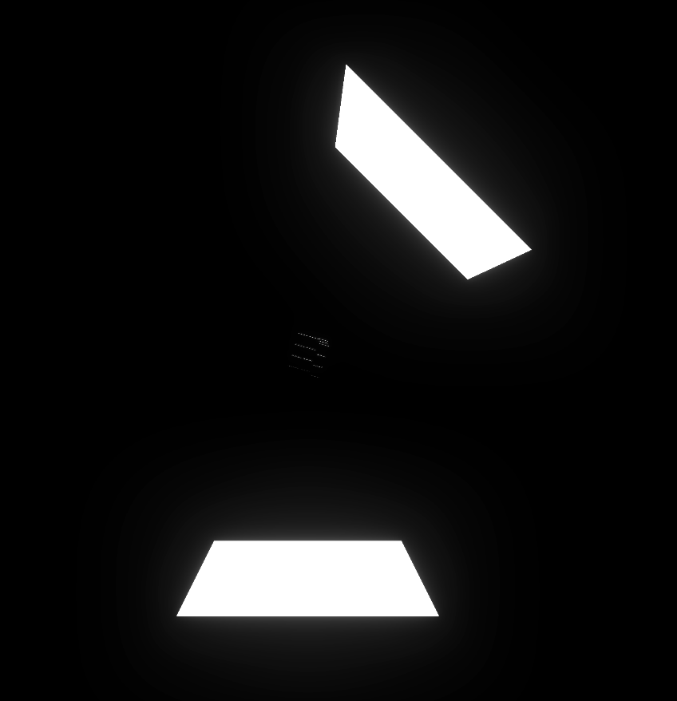
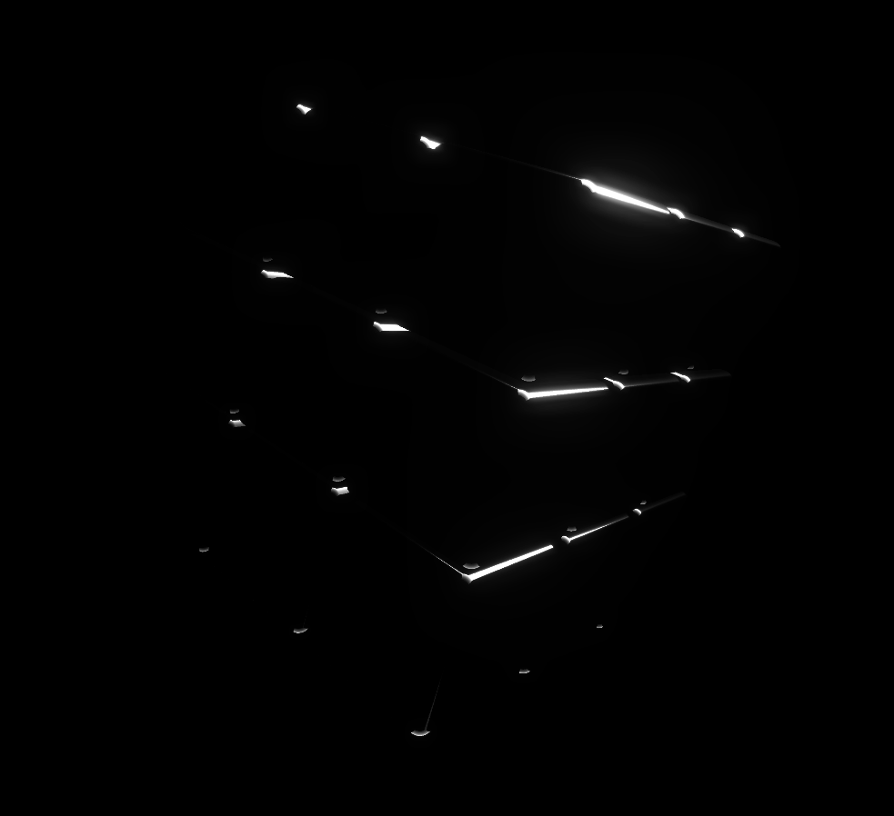
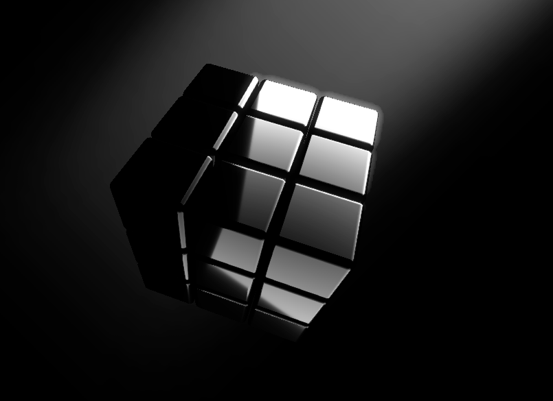

<iframe src="../public/resend_cube_3.html" height="400px" width="100%" style="border:none;"></iframe>
<figcaption align = "center">The final result (adjusted slightly to work on mobile as well). Interactive on desktop. (code at the end of the post)</figcaption>

This is the final part of the Resend cube lookalike series where we are trying to recreate the Resend cube. This time we fix the lights and add the "god rays" which are a pretty neat trick as we find out. You can get caught up with parts 1 and 2 here: [part 1](https://devslovecoffee.com/making-the-resend-cube-from-scratch-using-three-js/), [part 2](https://devslovecoffee.com/resend-cube-lookalike-part-2/).

## Lights

the current lights setup is shown below:



The effect it creates is not ideal - we never have a whole side of the cube highlighted, but always only a circle within the side - demonstrated by the video below. To make the lightning look better, we can use different kind of lights - RectAreaLight.


RectAreaLights are literally just panes which emit light. If we make them big enough, we can make the whole side of the cube highlighted. To make the RectAreaLights work though, we have to change the controls of our cube - instead of orbit controls, we need to rotate the whole cube. We will see why in a while.

Starting with some imports, we add the following lines to our importmap (if you don't have an importmap to add to, you might want to check the [part 2](https://devslovecoffee.com/resend-cube-lookalike-part-2/) of this series):

```javascript
"RectAreaLightHelper": "https://cdn.jsdelivr.net/npm/three@0.154.0/examples/jsm/helpers/RectAreaLightHelper.js",
"RectAreaLightUniformsLib": "https://cdn.jsdelivr.net/npm/three@0.154.0/examples/jsm/lights/RectAreaLightUniformsLib.js"
...
import { RectAreaLightHelper } from 'RectAreaLightHelper';
import { RectAreaLightUniformsLib } from 'RectAreaLightUniformsLib';
```

Now we edit the Lights section of the code (search for `// Create the light`) by replacing the lights with a single `RectAreaLight`.

```javascript
// Create the light
RectAreaLightUniformsLib.init();
const rectLight1 = new THREE.RectAreaLight( 0xffffff, 10, 100, 100 );
rectLight1.position.set( -5, 5, 5 );
scene.add( rectLight1 );

scene.add( new RectAreaLightHelper( rectLight1 ) );
```

Rotating the cube, you can see it looks much better. You can also see a huge pane of light, which is not desired and needs getting rid of. Here comes the rotating the cube instead of using orbit controls part.

### Rotation

Borrowing some code from this [jsfiddle](https://jsfiddle.net/MadLittleMods/n6u6asza/), we can rotate the cube on drag instead of rotating the camera, which stays fixed - allowing us to place the lights outside of the camera view, but still casting light on the cube.

The problem is that there are rotations already going on with the cube. Lucky for us, we can use the same solution we did in part 2 - we just wrap the cube in another object which we apply the rotations to - shown below.



To begin, we replace the old wrapper code inside makeCubes function with the following:

```javascript
// Replace this:
const wrapper = new THREE.Object3D();
wrapper.add(cubes);
return wrapper;

// With this:
const innerWrapper = new THREE.Object3D();
innerWrapper.add(cubes);
const outerWrapper = new THREE.Object3D();
outerWrapper.add(innerWrapper);
return outerWrapper;
```

We also need to update our tRotate call to account for the added wrapper:

```javascript
// cube.children[0] = the outer wrapper;
// cube.children[0].children[0] = the inner wrapper;
// cube.children[0].children[0].children[0] one side of the actual cube
tRotate(cube.children[0].children[0], 2000);
```

Now you should see the cube working exactly as before - the whole cube should be rotating and the sided should be rotating as well. 

Our next step is to remove all logic regarding the orbit controls and replace it with the "drag controls". Below are the lines we are removing (you can search for them in the code):

```javascript
"OrbitControls":"https://cdn.jsdelivr.net/npm/three@0.142.0/examples/jsm/controls/OrbitControls.js",
...
import { OrbitControls } from 'OrbitControls';
...
const controls = new OrbitControls(camera,renderer.domElement);
// disable zoom
controls.enableZoom = false;
// disable pan
controls.enablePan = false;
...
controls.update();
```

If done correctly, you have lost the ability to rotate the cube and the page still runs fine inside your browser. Now let's steal some code from the jsfiddle. We will add a "Controls" section right before animating the cube and a call of the update function right after calling animate():

```javascript
// Controls
var isDragging = false;
var previousMousePosition = {
    x: 0,
    y: 0
};
addEventListener('mousedown', function(e) {
    isDragging = true;
})
addEventListener('mousemove', function(e) {
    // get how much the mouse has moved
    let deltaMove = {
        x: e.offsetX-previousMousePosition.x,
        y: e.offsetY-previousMousePosition.y
    };
    
    if(isDragging) {
        // prepare the rotation
        let deltaRotationQuaternion = new THREE.Quaternion()
            .setFromEuler(new THREE.Euler(
                toRadians(deltaMove.y * 1),
                toRadians(deltaMove.x * 1),
                0,
                'XYZ'
            ));
        // actually rotate the cube (the outer wrapper)
        cube.quaternion.multiplyQuaternions(deltaRotationQuaternion, cube.quaternion);
    }
    // store the prev position
    previousMousePosition = {
        x: e.offsetX,
        y: e.offsetY
    };
});

addEventListener('mouseup', function(e) {
    isDragging = false;
});

let lastFrameTime = new Date().getTime() / 1000;
let totalGameTime = 0;

function update() {
    setTimeout(function() {
        let currTime = new Date().getTime() / 1000;
        let dt = currTime - (lastFrameTime || currTime);
        totalGameTime += dt;
        update(dt, totalGameTime);
        lastFrameTime = currTime;
    }, 0);
}
// Animate the cube
function animate() {
    requestAnimationFrame(animate);
    cube.children[0].rotation.x += 0.005;
    cube.children[0].rotation.y += 0.005;
    cube.children[0].rotation.z += 0.005;
    TWEEN.update();
    composer.render();
}
animate();
update();
```

You should be able to rotate the cube again. Awesome. Now for the fancy lights: what you should see right now is a somewhat faded cube - we have lost the direct light on either side. We need to bring that back by adding more rect lights.

### Adding more rect lights

I have tinkered with the lights, so you don't have to. You're welcome. Here is the configuraiton I personally like:

```javascript
// Create the light
RectAreaLightUniformsLib.init();
const rectLight1 = new THREE.RectAreaLight( 0xffffff, 100, 20, 20 );
rectLight1.position.set( 10, 15, 0 );
rectLight1.rotation.x = Math.PI * 1.5;
rectLight1.rotation.y = Math.PI / 4;
scene.add( rectLight1 );
const rectLight2 = new THREE.RectAreaLight( 0xffffff, 5, 20, 20 );
rectLight2.position.set( 0, -20, 0 );
rectLight2.rotation.x = Math.PI / 2
scene.add( rectLight2 );

scene.add( new RectAreaLightHelper( rectLight1 ) );
scene.add( new RectAreaLightHelper( rectLight2 ) );
```
And here is what it looks like from distance:



Pretty sick. I encourage you to play with the light and find out what you like. Pro tip: when positioning the lights, pause the animation by commenting out the following lines:

```javascript
cube.children[0].rotation.x += 0.005;
cube.children[0].rotation.y += 0.005;
cube.children[0].rotation.z += 0.005;
TWEEN.update();
```

and setting camera.position.z to a high number (like 60), so you get an overview of the scene.

## God rays

Now let's look at a pretty neat trick I think (might be a complete conspiration by me) the Resend guys did - using the god rays to fix a flaw of the cube where it sometimes almost entirely blends into the background. The image below demonstrates the issue. 



To fix this (or at least I think that's what happened), they introduced an element serving both as a "light source", but more importantly serving as a background for the cube in the case it gets too dark. Giving it a lighter background keeps the outline visible and you won't get "lost" (suddenly realise you don't know what you are looking at).

So how do we add it? This time we don't use the fancy Three.js, but turn to our old friends HTML and CSS. 

Starting off, we need to place the three canvas above the future light ray. We create a `div` element we will use as the container for our canvas and while we are at it, we also add the light ray divs:

```html
<div class="canvas-container" id="canvasContainer"></div>
<div class="god-rays-wrapper"><div class="god-rays"></div></div>
```

You can place the elements anywhere within the `<body>` tag. Next we set up the canvas to be a child of our container:

```javascript
// replace this:
document.body.appendChild(renderer.domElement);

// with this:
const container = document.getElementById( 'canvasContainer' );
container.appendChild(renderer.domElement);
```

Next we can add the css required to make it work. In the <style> tag, add the following lines:

```html
<style>
    body {
        margin: 0;
        background: black;
    }
    canvas {
        display: block;
        position: absolute;
        z-index: 100;
    }
    .canvas-container {
        width: 100%;
        height: 100%;
    }
    .god-rays-wrapper {
        position: fixed;
        top: 0;
        right: 0;
        z-index: 0;
        width: 1000px;
        height: 350px;
        transform: rotate(-45deg);
        filter: blur(50px);
        pointer-events: none;
    }
    .god-rays {
        width: 100%;
        height: 100%;
        background: white;
        opacity: 0.5;
        mask-image: linear-gradient(to right, rgba(0, 0, 0, 0), rgba(0, 0, 0, 1));
        -webkit-mask-image: linear-gradient(to right, rgba(0, 0, 0, 0), rgba(0, 0, 0, 1));
        mix-blend-mode: screen;
    }
</style>
```

And you are good to go... except that nothing changed. That is because I lied, and we actually need to do some work in three to remove the background opacity and let the light ray shine through.

### Removing scene background

This might seem like and easy task - remove the scene background and we are done. At least that's what I thought. The reality is not so bright as we will soon find out. 

We can really start with removing the scene background, which is this line: `scene.background = new THREE.Color( 0x000000 );`. We should then set the rendering to support opacity by adding alpha to renderer options:

```javascript
const renderer = new THREE.WebGLRenderer({
  antialias: false,
  alpha: true,
});
```

We still can't see the light ray. That is, as I've found out ([here](https://discourse.threejs.org/t/transparent-background/22742) and [here](https://stackoverflow.com/questions/20899326/how-do-i-stop-effectcomposer-from-destroying-my-transparent-background)) because our Bloom pass does not support opacity. The solution - replace the rendering pipeline.

We will replace our render pass and our effects pass from three with effects from [postprocessing](https://github.com/pmndrs/postprocessing) library by [Poimandres](https://github.com/pmndrs). Let's start by importing it (add to importmap + call inside script)

```javascript
// add to importmap
"postprocessing": "https://cdn.jsdelivr.net/npm/postprocessing@6.32.2/+esm"

// add to script
import {
    BloomEffect,
    FXAAEffect,
    EffectComposer,
    EffectPass,
    RenderPass
} from "postprocessing";
```

We then replace the following code:

```javascript
// Create the renderer
const renderer = new THREE.WebGLRenderer({antialias: true});
renderer.setSize(window.innerWidth, window.innerHeight);
// make it sharper
renderer.setPixelRatio(window.devicePixelRatio * 1.5);
document.body.appendChild(renderer.domElement);

// Create effects
const bloomPass = new UnrealBloomPass(new THREE.Vector2(1000, 1000), 1.5, 0.4, 0.85)
bloomPass.threshold = 0.4
bloomPass.strength = 0.7
bloomPass.radius = 0.2
bloomPass.renderToScreen = true

var composer = new EffectComposer(renderer);
composer.setSize(window.innerWidth, window.innerHeight);
var renderPass = new RenderPass(scene, camera);

composer.addPass(renderPass);
composer.addPass(bloomPass);
```

with a more readable and updated function addRendering:

```javascript
function addRendering() {
        // Create the renderer
        const renderer = new THREE.WebGLRenderer({
        antialias: false,
        alpha: true,
        powerPreference: "high-performance",
        stencil: false,
        depth: false
    });

    renderer.setSize(window.innerWidth, window.innerHeight);
    renderer.autoClear = false;

    const container = document.getElementById( 'canvasContainer' );
    container.appendChild(renderer.domElement);

    const bloomOptions = {
        luminanceThreshold: 0.9,
        luminanceSmoothing: 0.7,
        intensity: 0.8,
        radius: 0.1,
    }
    const bloomPass = new BloomEffect(bloomOptions);
    const FXAAPass = new FXAAEffect();

    var composer = new EffectComposer(renderer);
    composer.setSize(window.innerWidth, window.innerHeight);
    composer.addPass(new RenderPass(scene, camera));
    composer.addPass(new EffectPass(camera, FXAAPass, bloomPass));
    return composer;
}
    
const composer = addRendering();
```

Additionally, we replace the animate function at the end of our code:

```javascript
function animate() {
    requestAnimationFrame(animate);
    cube.rotation.x += 0.005;
    cube.rotation.y += 0.005;
    cube.rotation.z += 0.005;
    controls.update();
    TWEEN.update();
    composer.render();
}
animate();
update();
```

with a direct call to requestAnimationFrame: 

```javascript
requestAnimationFrame(function render() {
    requestAnimationFrame(render);
    cube.children[0].rotation.x += 0.005;
    cube.children[0].rotation.y += 0.005;
    cube.children[0].rotation.z += 0.005;
    TWEEN.update();
    composer.render();
});
update();
```

If you've done everything correctly, the light ray should be visible now. The screenshot below shows what it looks like (note: this is a happy case set up to look good). 



Based on your screen resolution though, the rays might not look the best - they might not be aligned, or might not reach the dark parts of the cube. Let's fix that.

### Centering the rays to the cube

We can resolve the issues by setting our renderer to a fixed size and centering the god rays to the cube, making them always align perfectly. Starting off, we set the size of our composer to 600 by 600 pixels - `composer.setSize(600, 600);`.

Next we must set the aspect ratio of our camera to reflect the changed aspect ratio of the renderer. Since we are rendering a 600px by 600px square, the aspect ratio will be 1 - `const camera = new THREE.PerspectiveCamera(75, 1, 0.1, 1000);`.

And lastly, we re-center the cube by editing the css for our canvas:

```css
canvas {
    display: block;
    position: absolute;
    z-index: 100;
    left: 50%;
    top: 50%;
    transform: translate(-50%, -50%);
}
```

Now the cube stays in the center regardless of the window size (and we don't have to add three resizing). Next, we fix the light ray in place:

```css
.god-rays-wrapper {
    position: absolute;
    left: 50%;
    top: 50%;
    transform: translate(-50%, -50%)  rotate(-50deg);
    z-index: 0;
    width: 100%;
    height: 350px;
    filter: blur(50px);
    pointer-events: none;
}
```

Now if you resize the window, the light ray stays in the same place, always seemingly radiating light towards the cube.

## Closing thoughts

I have refactored the final code, so it is more readable, and as always, you can find it at the end of the post.

And we are done. I think we have a pretty solid Resend cube lookalike. Of course, it will never be exactly the original (and it is not trying to), but I'd say it's close.

Thanks for reading this post (and the series). It's been fun and insightful for me to make it. I certainly have learned a ton of stuff and hope you have as well. I'd be happy to hear any feedback either via email at petttr1[at]gmail[dot]com, or via [Twitter](https://twitter.com/devslovecoffee). 

```html
<!DOCTYPE html>
<html lang="en">
<head>
    <meta charset="UTF-8">
    <title>Resend Cube Lookalike</title>
    <style>
        body {
            margin: 0;
            background: black;
        }
        canvas {
            display: block;
            position: absolute;
            z-index: 100;
            left: 50%;
            top: 50%;
            transform: translate(-50%, -50%);
        }
        .canvas-container {
            width: 100%;
            height: 100%;
        }
        .god-rays-wrapper {
            position: absolute;
            left: 50%;
            top: 50%;
            transform: translate(-50%, -50%)  rotate(-50deg);
            z-index: 0;
            width: 100%;
            height: 350px;
            filter: blur(50px);
            pointer-events: none;
        }
        .god-rays {
            width: 100%;
            height: 100%;
            background: white;
            opacity: 0.4;
            mask-image: linear-gradient(to right, rgba(0, 0, 0, 0), rgba(0, 0, 0, 1));
            -webkit-mask-image: linear-gradient(to right, rgba(0, 0, 0, 0), rgba(0, 0, 0, 1));
            mix-blend-mode: screen;

        }
    </style>
    <script type="importmap">
        {
            "imports": {
                "three": "https://cdn.jsdelivr.net/npm/three@0.154.0/build/three.module.js",
                "UnrealBloomPass":"https://cdn.jsdelivr.net/npm/three@0.154.0/examples/jsm/postprocessing/UnrealBloomPass.js",
                "EffectComposer":"https://cdn.jsdelivr.net/npm/three@0.154.0/examples/jsm/postprocessing/EffectComposer.js",
                "RenderPass":"https://cdn.jsdelivr.net/npm/three@0.154.0/examples/jsm/postprocessing/RenderPass.js",
                "tween": "https://cdn.jsdelivr.net/npm/@tweenjs/tween.js@18.5.0/dist/tween.esm.js",
                "RectAreaLightHelper": "https://cdn.jsdelivr.net/npm/three@0.154.0/examples/jsm/helpers/RectAreaLightHelper.js",
                "RectAreaLightUniformsLib": "https://cdn.jsdelivr.net/npm/three@0.154.0/examples/jsm/lights/RectAreaLightUniformsLib.js",
                "postprocessing": "https://cdn.jsdelivr.net/npm/postprocessing@6.32.2/+esm"
            }
        }
    </script>
</head>
<body>
<script type="module">
    import * as THREE from 'three';
    import TWEEN from 'tween';
    import { RectAreaLightHelper } from 'RectAreaLightHelper';
    import { RectAreaLightUniformsLib } from 'RectAreaLightUniformsLib';
    import {
        BloomEffect,
        FXAAEffect,
        EffectComposer,
        EffectPass,
        RenderPass
    } from "postprocessing";

    const CUBES_PER_SIDE = 3;

    function toRadians(angle) {
        return angle * (Math.PI / 180);
    }

    function createBoxWithRoundedEdges( width, height, depth, radius0, smoothness ) {
        let shape = new THREE.Shape();
        let eps = 0.00001;
        let radius = radius0 - eps;
        shape.absarc( eps, eps, eps, -Math.PI / 2, -Math.PI, true );
        shape.absarc( eps, height -  radius * 2, eps, Math.PI, Math.PI / 2, true );
        shape.absarc( width - radius * 2, height -  radius * 2, eps, Math.PI / 2, 0, true );
        shape.absarc( width - radius * 2, eps, eps, 0, -Math.PI / 2, true );
        let geometry = new THREE.ExtrudeGeometry( shape, {
            depth: depth - radius0 * 2,
            bevelEnabled: true,
            bevelSegments: smoothness * 2,
            steps: 1,
            bevelSize: radius,
            bevelThickness: radius0,
            curveSegments: smoothness
        });

        geometry.center();

        return geometry;
    }

    function makeCubes() {
        const material = new THREE.MeshStandardMaterial({ color: 0x000000, metalness: 1., roughness: 0.01 });
        const numCubes = CUBES_PER_SIDE;
        // Create the group, we will add layers to the group
        const cubes = new THREE.Object3D();
        // iterate over all dimensions
        const offset = (numCubes - 1) / 2;
        for(let i = 0; i < numCubes; i ++) {
            // create the layer
            const layer = new THREE.Object3D();
            for(let j = 0; j < numCubes; j ++) {
                for(let k = 0; k < numCubes; k ++) {
                    const geom = createBoxWithRoundedEdges(1, 1, 1, .09, 40);
                    const x = (i - offset) * 1.03;
                    const y = (j - offset) * 1.03;
                    const z = (k - offset) * 1.03;
                    geom.translate(x, y, z);
                    const cube = new THREE.Mesh(geom, material);
                    layer.add(cube);
                }
            }
            cubes.add(layer);
        }
        const innerWrapper = new THREE.Object3D();
        innerWrapper.add(cubes);
        const outerWrapper = new THREE.Object3D();
        outerWrapper.add(innerWrapper);
        return outerWrapper;
    }

    function tRotate( cube, delay ) {
        // rotate the wrapped cube 90 deg along y/z axis
        if (Math.random() > 0.5) {
            cube.rotateY(Math.PI / 2);
        }
        else {
            cube.rotateZ(Math.PI / 2);
        }
        // pick a random layer to rotate
        const sideIndex = Math.floor(Math.random() * CUBES_PER_SIDE);
        const side = cube.children[sideIndex];

        // pick a random direction to rotate
        const angles = {
            x: Math.random() > 0.5 ? -Math.PI : Math.PI,
            y:0,
            z:0
        }

        // pick a random time to wait between rotations
        const pause = Math.random() * 1000;

        new TWEEN.Tween(side.rotation)
            .delay(pause)
            .to( {
                x: side.rotation._x + angles.x,
                y: side.rotation._y + angles.y,
                z: side.rotation._z + angles.z
            }, delay )
            .onComplete(function() {
                setTimeout( tRotate, pause, cube, delay );
            })
            .start();
    }

    function constructScene() {
        // Create the scene
        const scene = new THREE.Scene();

        // Create the light
        RectAreaLightUniformsLib.init();
        const rectLight1 = new THREE.RectAreaLight( 0xffffff, 100, 20, 20 );
        rectLight1.position.set( 10, 15, 0 );
        rectLight1.rotation.x = Math.PI * 1.5;
        rectLight1.rotation.y = Math.PI / 4;
        scene.add( rectLight1 );

        const rectLight2 = new THREE.RectAreaLight( 0xffffff, 5, 20, 20 );
        rectLight2.position.set( 0, -20, 0 );
        rectLight2.rotation.x = Math.PI / 2
        scene.add( rectLight2 );

        scene.add( new RectAreaLightHelper( rectLight1 ) );
        scene.add( new RectAreaLightHelper( rectLight2 ) );

        // Create a cube
        const cube = makeCubes();
        scene.add(cube);
        return {scene, cube};
    }

    function addControls() {
        addEventListener('mousedown', () => {
            isDragging = true;
        })
        addEventListener('mousemove', (e) => {
            // get how much the mouse has moved
            let deltaMove = {
                x: e.offsetX-previousMousePosition.x,
                y: e.offsetY-previousMousePosition.y
            };

            if(isDragging) {
                // prepare the rotation
                let deltaRotationQuaternion = new THREE.Quaternion()
                    .setFromEuler(new THREE.Euler(
                        toRadians(deltaMove.y * 1),
                        toRadians(deltaMove.x * 1),
                        0,
                        'XYZ'
                    ));
                // actually rotate the cube (the outer wrapper)
                cube.quaternion.multiplyQuaternions(deltaRotationQuaternion, cube.quaternion);
            }
            // store the prev position
            previousMousePosition = {
                x: e.offsetX,
                y: e.offsetY
            };
        });

        addEventListener('mouseup', () => {
            isDragging = false;
        });
    }

    function addCamera() {
        // Create the camera
        const camera = new THREE.PerspectiveCamera(75, 1, 0.1, 1000);
        // Position the camera
        camera.position.z = 6;
        camera.lookAt(new THREE.Vector3(0., 0., 0.));
        return camera;
    }

    function addRendering() {
        // Create the renderer
        const renderer = new THREE.WebGLRenderer({
            antialias: false,
            alpha: true,
            powerPreference: "high-performance",
            stencil: false,
            depth: false
        });

        renderer.autoClear = false;

        const container = document.getElementById( 'canvasContainer' );
        container.appendChild(renderer.domElement);

        const bloomOptions = {
            luminanceThreshold: 0.9,
            luminanceSmoothing: 0.7,
            intensity: 0.8,
            radius: 0.1,
        }
        const bloomPass = new BloomEffect(bloomOptions);
        const FXAAPass = new FXAAEffect();

        var composer = new EffectComposer(renderer);
        composer.setSize(600, 600);
        composer.addPass(new RenderPass(scene, camera));
        composer.addPass(new EffectPass(camera, FXAAPass, bloomPass));
        return composer;
    }

    function update() {
        setTimeout(function() {
            let currTime = new Date().getTime() / 1000;
            let dt = currTime - (lastFrameTime || currTime);
            totalGameTime += dt;
            update(dt, totalGameTime);
            lastFrameTime = currTime;
        }, 0);
    }

    // Controls
    let isDragging = false;
    let previousMousePosition = {
        x: 0,
        y: 0
    };

    let lastFrameTime = new Date().getTime() / 1000;
    let totalGameTime = 0;

    const {scene, cube} = constructScene();
    const camera = addCamera();
    const composer = addRendering();

    // cube.children[0] = the outer wrapper;
    // cube.children[0].children[0] = the inner wrapper;
    // cube.children[0].children[0].children[0] one side of the actual cube
    tRotate(cube.children[0].children[0], 2000);

    requestAnimationFrame(function render() {
        requestAnimationFrame(render);
        cube.children[0].rotation.x += 0.005;
        cube.children[0].rotation.y += 0.005;
        cube.children[0].rotation.z += 0.005;
        TWEEN.update();
        composer.render();
    });
    addControls();
    update();
</script>
<div class="canvas-container" id="canvasContainer"></div>
<div class="god-rays-wrapper"><div class="god-rays"></div></div>
</body>
</html>
```

Part 1 with the basics is here: [https://devslovecoffee.com/making-the-resend-cube-from-scratch-using-three-js/](https://devslovecoffee.com/making-the-resend-cube-from-scratch-using-three-js/).
Part 2 with the Bloom and Animation here: [https://devslovecoffee.com/resend-cube-lookalike-part-2/](https://devslovecoffee.com/resend-cube-lookalike-part-2/).